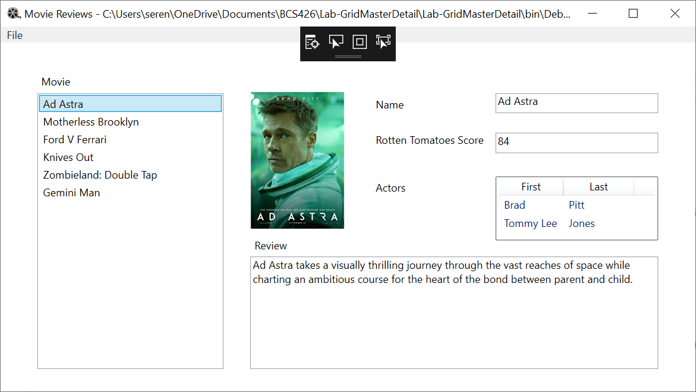

# Movie Reviews
A C# WPF application that contains a master-detail interface for displaying movie details including movie name, Rotten Tomatoes Score, review, and movie poster images. This application reads movie data from a text file and utilizes multiple controls to display details of the currently selected record in the master list.

